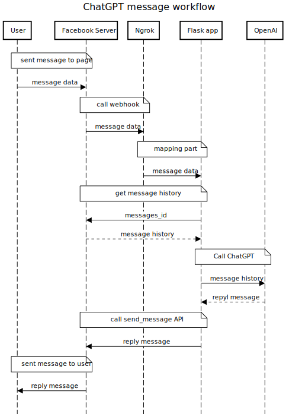

# Enhance your chatbot with Chat-GPT

In this guide, we will walk you through the steps of enhancing your existing Facebook chatbot by integrating it with Chat-GPT from OpenAI. We will modify a Python script (`server.py`) which uses the Flask web framework. 

## Workflow

Below is a sequence diagram that outlines the basic workflow of our enhanced chatbot.



## Step-by-Step Guide

### 1. Import Required Libraries

We will start by importing the necessary Python libraries. Add the following lines at the beginning of your `server.py` file:

```python
import logging
import openai
```

### 2. Add Global Parameters

Next, we will define global parameters required for both the Facebook API and OpenAI API:

```python
# facebook parameter
fb_verify_token = "your_fb_verify_token"
app_secret = "your_app_secret"
fb_page_access_token = "your_fb_page_access_token"
fb_api_url = "https://graph.facebook.com/v2.6/"
page_id = "your_page_id"

# openai parameter
openai.api_key = "your_openai_api_key"

# chatbot parameter
message_count = 10
```

Replace the placeholder values (`"your_app_secret"`, `"your_fb_page_access_token"`, etc.) with your actual values.

### 3. Fetch Conversation History

We will define two functions `get_history_message()` and `get_message()` to fetch the conversation history which we will use as input for the Chat-GPT model:

```python
def get_history_message(sender):
    print("get_history_message running")
    url = f"{fb_api_url}{page_id}/conversations/?user_id={sender}&access_token={fb_page_access_token}&fields=messages"
    response = requests.request("GET", url, headers={}, data={})
    chat_history = []
    chat_ids = response.json()["data"][0]["messages"]["data"]
    for chat in chat_ids[:message_count]:
        messages_id = chat["id"]
        created_time = chat["created_time"]
        get_message_response = get_message(messages_id)
        message = get_message_response["message"]
        from_id = get_message_response["from"]["id"]
        chat_history.append({"message":message, "from_id":from_id})
    return chat_history

def get_message(messages_id):
    url = f"{fb_api_url}{messages_id}?access_token={fb_page_access_token}&fields=from,message"
    response = requests.request("GET", url, headers={}, data={})
    return response.json()
```

### 4. Convert to ChatGPT Messages

This function, `convert_to_chatgpt_message()`, takes in the conversation history and the latest message as inputs, and returns a list of message dictionaries where each dictionary includes a 'role' (either 'user' or 'assistant') and 'content' (the message itself). The message dictionaries are in the required format for GPT-3's chat models.

```python
def convert_to_chatgpt_message(chat_history, message):
    messages = []
    for chat in chat_history[::-1]:
        role = "user"
        if chat["from_id"]==page_id:
            role = "assistant"
        content  = chat["message"]
        messages.append({"role":role, "content":content})
    messages.append({"role":"user", "content":"Answer polite and concisely in a single sentence : "+ message})
    return messages
```

### 5. Add Chat-GPT Function

We will then define a new function `generate_reply()` which uses the `openai.ChatCompletion.create()` function to generate a reply from the Chat-GPT model:

```python
def generate_reply(messages):
    try:
        response = openai.ChatCompletion.create(
            model="gpt-3.5-turbo",
            messages=messages,
            temperature=0.2,
            top_p=0.2,
            max_tokens=512,
        )
        
        response_message = response.choices[0].message.content
        finish_reason = response.choices[0].finish_reason

        if finish_reason == "length":
            response_message = response_message+"..."

    except Exception as e:
        logging.error(f"Unexpected error: {str(e)}")
        response_message = "please try again later"

    return response_message 
```


### 6. Edit Existing Code

Next, we will edit the `listen()` and `send_message()` functions in your existing `server.py` script. Inside `listen()`, we fetch the conversation history and generate a reply using the `generate_reply()` function. We then send this reply with the `send_message()` function:

```python
@app.route("/webhook", methods=["GET","POST"])
def listen():
    """This is the main function flask uses to 
    listen at the `/webhook` endpoint"""
    if request.method == "GET":
        return verify_webhook(request)

    if request.method == "POST":
        if validate_request(request):
            payload = request.json
            event = payload["entry"][0]["messaging"]
            for x in event:
                if is_user_message(x):
                    text = x["message"]["text"]
                    sender_id = x["sender"]["id"]
                    message_id = x["message"]["mid"]

                    # Fetch conversation history
                    chat_history = get_history_message(sender_id)

                    # Convert the conversation history to chatgpt format
                    messages = convert_to_chatgpt_message(chat_history, text)

                    # Generate reply with Chat-GPT
                    reply_message = generate_reply(messages)

                    send_message(sender_id, reply_message)
            return "ok"
        else:
            return "invalid"

```

Adding logging to your application is a great way to track down and diagnose errors. Here's how you can add the logging configuration to your `server.py` script.

```python
# Logging Configuration
logging.basicConfig(filename="openai_api_errors.log", level=logging.ERROR)
```

This line should be placed at the top of your Python script, before the application code begins. It sets up a basic configuration for logging to a file named `openai_api_errors.log`. Only error messages or higher will be logged.

That's it! You have now successfully integrated your Facebook chatbot with Chat-GPT. You can now run your `server.py` script without syntax errors. Enjoy the enhanced conversational capabilities of your chatbot!