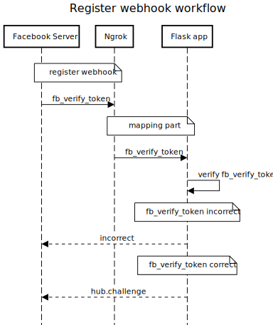
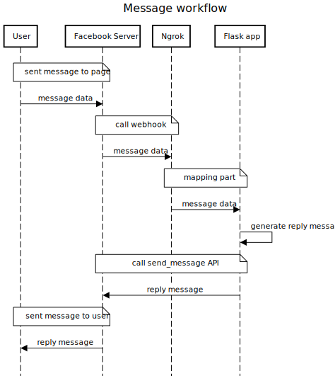

# Create Your First Facebook Chatbot

This guide will walk you through the process of creating a simple Facebook chatbot using the Facebook Messenger Platform, Python, Flask, and ngrok.

## 1. **Create a Facebook Page**

To attach the chatbot, you will need a Facebook page. If you already have one, you can skip this step. If not, follow these steps:

- Visit [Facebook Pages](https://www.facebook.com/pages/create/)
- Choose a Page type
- Fill out the required information
- Click "Create Page"

## 2. **Create a Developer Account**

To build a chatbot, you'll need a developer account on Facebook:

- Go to [Facebook Developers](https://developers.facebook.com/)
- Click "Get Started" in the upper right corner
- Follow the prompts to register as a developer

## 3. **Create an App**

- Visit your [Developer Dashboard](https://developers.facebook.com/apps/), click "Create App"
- Select "Business" as the purpose of your app and click "Continue"
- Fill out your app details and click "Create App"

## 4. **Generate a Page Messenger Token**

- Navigate to your App Dashboard
- In the Messenger section, click "Set Up"
- In "Access Tokens", click "Add or Remove Pages"
- Choose the page you want to generate a token for from the dropdown menu
- Click "Generate Token"
- Copy and securely store the generated token as it will not be shown again

## 5. **Create a Flask App and Verify Webhook**



To communicate with Facebook servers, you'll need to set up a webhook. This involves creating a Flask endpoint to accept these webhook events:

```python
from flask import Flask, request

app = Flask(__name__)

@app.route("/webhook", methods=["GET"])
def listen():
    print(f"Calling webhook method : {request.method}")
    """This is the main function Flask uses to 
    listen at the `/webhook` endpoint"""
    if request.method == "GET":
        return verify_webhook(request)
```

Additionally, here's a sample `verify_webhook` function:

```python
def verify_webhook(req):
    print("verify_webhook running")
    calling_verify_token = req.args.get("hub.verify_token")
    print(f"calling_verify_token : {calling_verify_token}")
    fb_verify_token = "<Your Verification Token>"
    if calling_verify_token == fb_verify_token:
        challenge = req.args.get("hub.challenge")
        return challenge
    else:
        return "incorrect"
```

Replace `"<Your Verification Token>"` with your actual Facebook verification token.

- Use ngrok to create a secure tunnel to your webhook
- In your Facebook app settings, set the Callback URL to your ngrok URL + /webhook
- The verify token should be the same one you put in your `verify_webhook` function
- After setting the Callback URL and Verify Token, click "Verify and Save"

## 6. **Edit Page Subscriptions**

To receive messages and postbacks, you need to set up your page subscription:

- Return to the Messenger settings in your app dashboard
- Under "Webhooks", click "Edit Callback URL"
- Re-enter your Callback URL and Verify Token
- In the "Subscription Fields" section, select "messages" and "messaging_postbacks"
- Click "Save"

Now, whenever a user sends a message or clicks a postback button in your chatbot, Facebook will send an HTTP POST request to your webhook.

## 7. **Sending a Response Message**



After the webhook verification, the Flask app should handle incoming messages and postbacks. Below is an example of a `send_message` function that sends a response back to Facebook by modifying the `listen()` function:

```python
import requests

@app.route("/webhook", methods=["GET","POST"])
def listen():
    print(f"Calling webhook method : {request.method}")
    """This is the main function Flask uses to 
    listen at the `/webhook` endpoint"""
    if request.method == "GET":
        return verify_webhook(request)
    if request.method == "POST":
        payload = request.json
        event = payload["entry"][0]["messaging"]
        for x in event:
            text = x["message"]["text"]
            sender_id = x["sender"]["id"]
            reply_message = f"reply for:{text}"
            send_message(sender_id, reply_message)
        return "ok"
```

Here's the `send_message` function:

```python
def send_message(recipient_id, reply_message):
    """Send a response to Facebook"""
    fb_page_access_token = "<Your Page Access Token>"
    fb_api_url = "https://graph.facebook.com/v2.6/"

    payload = {
        "message": {
            "text": reply_message
        },
        "recipient": {
            "id": recipient_id
        },
        "notification_type": "regular"
    }
    auth = {
        "access_token": fb_page_access_token
    }
    response = requests.post(
        fb_api_url+"me/messages",
        params=auth,
        json=payload
    )
    return response.json()
```

Replace `<Your Page Access Token>` with your Facebook page access token. The `recipient_id` is the user's ID who will receive the message, and `text` is the message you want to send.

Now, whenever a user sends a message or clicks a postback button in your chatbot, Facebook will send an HTTP POST request to your webhook. The `send_message` function can respond to these interactions. Remember to handle exceptions to ensure a smooth user experience.